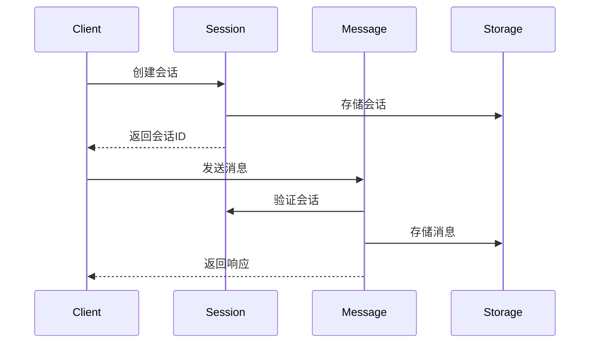

# 高层次设计

生成高层次设计文档，作为后续细化设计的输入基础。

## 输入

**设计主题**: $ARGUMENTS

## 核心原则

1. **设计优先** - 在设计获得批准之前，不进行代码实现
2. **层次分明** - 高层次设计只描述模块边界和交互，不涉及具体字段和接口
3. **可细化** - 输出必须足够清晰，能够指导后续 refine 迭代

## 输出标准

设计文档必须包含以下内容，才能作为 `/refine` 的有效输入：

| 必须包含 | 说明 |
|----------|------|
| 系统边界 | 解决什么问题，不解决什么 |
| 模块划分 | 有哪些模块，边界在哪 |
| 模块职责 | 每个模块负责什么功能 |
| 模块关系 | 模块间如何协作，数据如何流转 |
| 交互流程 | 关键业务场景的模块交互图 |
| 核心概念 | 领域术语定义 |
| 技术决策 | 存储选型、架构模式及理由 |

| 不应包含 | 由 refine 细化 |
|----------|---------------|
| 数据结构字段 | 第1轮 |
| API 路径和参数 | 第2轮 |
| 业务流程步骤 | 第3轮 |
| 错误码和存储键 | 第4轮 |

## 设计流程

### 阶段 1：背景与目标

```
## 设计主题: $ARGUMENTS

### 1.1 背景
- 为什么需要这个设计？
- 现有问题或机会是什么？

### 1.2 目标
- 要解决什么问题？
- 成功标准是什么？

### 1.3 范围
- 包含什么
- 不包含什么
```

### 阶段 2：架构与模块

```
### 2.1 技术选型
- 存储方案及理由
- 架构模式及理由
- 关键依赖

### 2.2 模块划分
| 模块 | 职责 | 边界说明 |
|------|------|----------|
| [模块A] | [职责] | [什么属于它，什么不属于] |
| [模块B] | [职责] | [边界说明] |

### 2.3 模块关系
- [模块A] → [模块B]: [依赖原因]
- [模块B] → [模块C]: [依赖原因]
```

### 阶段 3：交互流程

为每个关键业务场景绘制模块交互图：

```
### 3.1 [场景名称]

**触发**: [什么触发这个流程]

**流程图**:
```
[外部] --> [模块A] --> [模块B] --> [模块C]
           |            |
           v            v
        [存储A]      [存储B]
```

**说明**:
1. [模块A] 接收请求，做 [什么]
2. [模块A] 调用 [模块B]，传递 [什么]
3. [模块B] 处理后返回 [什么]
4. ...
```

### 阶段 4：核心概念

```
### 4.1 术语定义

| 术语 | 定义 | 示例 |
|------|------|------|
| [概念A] | [定义] | [示例] |
| [概念B] | [定义] | [示例] |

### 4.2 关键决策

| 决策 | 选择 | 理由 | 风险 |
|------|------|------|------|
| [决策点] | [选择] | [为什么] | [潜在问题] |
```

## 流程图规范

使用 Mermaid 或 ASCII 绘制模块交互图：

**Mermaid 示例**:


**ASCII 示例**:
```
┌────────┐     ┌─────────┐     ┌─────────┐
│ Client │────>│ Session │────>│ Storage │
└────────┘     └─────────┘     └─────────┘
                   │
                   v
              ┌─────────┐
              │ Message │
              └─────────┘
```

## 完成检查

设计完成后，确认以下问题可回答：

- [ ] 能否列出所有需要细化的模块？
- [ ] 每个模块的职责是否清晰？
- [ ] 模块间如何交互是否明确？
- [ ] 关键流程是否有交互图？

全部可回答 → 设计完成，可执行 `/refine [此文档]`

## 禁止事项

**不得**:
- 编写代码文件
- 定义具体字段和类型
- 设计 API 路径和参数
- 编写测试代码

**可以**:
- 阅读现有代码理解上下文
- 生成设计文档
- 绘制架构图和流程图
- 创建备选方案

## 输出位置

`docs/设计-[主题].md`

---

**当前设计任务**: $ARGUMENTS

请描述你的设计需求。
